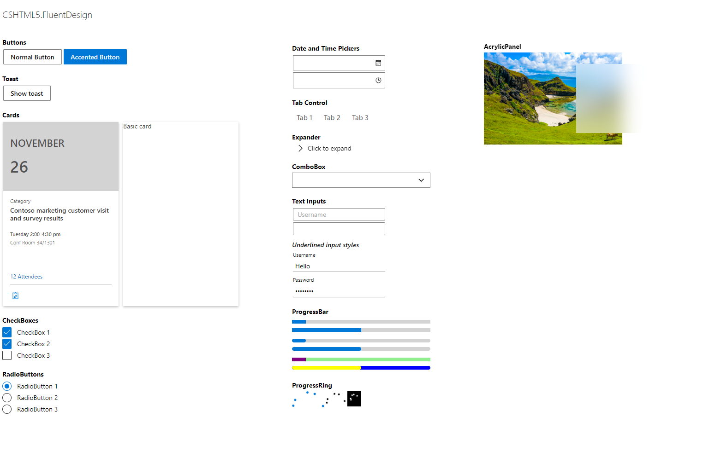
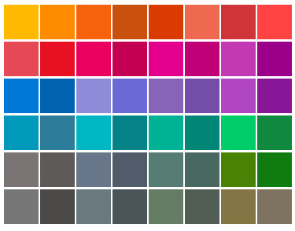

<h1 align="center">
<br />
CSHTML5.FluentDesign
</h1>

<h6 align="center">
  Fluent Design controls and styles for CSHTML5
</h6>


<h6 align="center">
  Note: This package is tested and works well on CSHTML5 version 2.0.0-alpha63-083 (NuGet)
</h6>


### Install

*NuGet Package*

`Install-Package CSHTML5.FluentDesign`

<https://www.nuget.org/packages/CSHTML5.FluentDesign/>


### Preparation

```diff
- Important Note: For NuGet package version 1.0.8 onwards, you are required to indicate the theme color in App.xaml
```


Add reference to App.xaml

```xml
<Application.Resources>
    <ResourceDictionary>
        <ResourceDictionary.MergedDictionaries>
             <!--Indicate the theme color, please refer to accent colors-->
             <ResourceDictionary Source="/CSHTML5.FluentDesign;component/Accents/DefaultBlue.xaml" />
          
             <!--  Fluent Design Styles and Controls  -->
            <ResourceDictionary Source="/CSHTML5.FluentDesign;component/FluentDesign.xaml" />
        </ResourceDictionary.MergedDictionaries>
    </ResourceDictionary>
</Application.Resources>
```


### Overview



### Colors

#### Accent Colors

Left to right, top to bottom

- YellowGold
- Gold
- OrangeBright
- OrangeDark
- Rust
- PaleRust
- BrickRed
- ModRed

<br/>

* PaleRed
* Red
* RoseBright
* Rose
* PlumLight
* Plum
* OrchidLight
* Orchid

<br/>

- DefaultBlue
- NavyBlue
- PurpleShadow
- PurpleShadowDark
- IrisPastel
- IrisSpring
- VioletRedLight
- VioletRed

<br/>

- CoolBlueBright
- CoolBlue
- SeaFoam
- SeaFoamTeal
- MintLight
- MintDark
- TurfGreen
- SportGreen

<br/>

- Gray
- GrayBrown
- SteelBlue
- MetalBlue
- PaleMoss
- Moss
- MeadowGreen
- Green

<br/>

- Overcast
- Storm
- BlueGray
- GrayDark
- LiddyGreen
- Sage
- CamouflageDesert
- Camouflage


#### Accent Color Brushes
|Sample|Color|Brush|
|-----|-----|-----|
||ImmersiveSystemAccentLight3|ImmersiveSystemAccentLight3Brush|
||ImmersiveSystemAccentLight2|ImmersiveSystemAccentLight2Brush|
||ImmersiveSystemAccentLight1|ImmersiveSystemAccentLight1Brush|
||ImmersiveSystemAccent|ImmersiveSystemAccentBrush|
||ImmersiveSystemAccentDark1|ImmersiveSystemAccentDark1Brush|
||ImmersiveSystemAccentDark2|ImmersiveSystemAccentDark2Brush|
||ImmersiveSystemAccentDark3|ImmersiveSystemAccentDark3Brush|

**Usage:**
```xml
 <Border Background="{StaticResource ImmersiveSystemAccentBrush}"/>
```


#### Base Color Brushes


|Light|Dark|Color|Brush|
|-----|-----|-----|-----|
|||SystemBaseHighColor|SystemBaseHighColorBrush|
|||SystemBaseMediumHighColor|SystemBaseMediumHighColorBrush|
|||SytemBaseMediumColor|SytemBaseMediumColorBrush|
|||SystemBaseMediumLowColor|SystemBaseMediumLowColorBrush|
|||SystemBaseLowColor|SystemBaseLowColorBrush|


#### Alt Color Brushes


|Light|Dark|Color|Brush|
|-----|-----|-----|-----|
|||SystemAltHighColor|SystemAltHighColorBrush|
|||SystemAltMediumHighColor|SystemAltMediumHighColorBrush|
|||SytemAltMediumColor|SytemAltMediumColorBrush|
|||SystemAltMediumLowColor|SystemAltMediumLowColorBrush|
|||SystemAltLowColor|SystemAltLowColorBrush|

**Usage:**
```xml
<Border Background="{StaticResource SystemBaseHighColorBrush">
  <TextBlock Foreground="{DynamicResource SystemAltHighColorBrush}"/>
</Border/>
```


### Styles

#### 1. Default Button
_No setting of style is required._

```xml
  <Button Content="Normal Button"/>
```
#### 2. Accented Button

```xml
  <Button Content="Accented Button" Style="{StaticResource Button_Accent}"/>
```
#### 3. Card
_Card style for Button_

```xml
  <Button Style="{StaticResource CardStyle}" Width="200" Height="150"/>
```
#### 4. CheckBox

```xml
  <CheckBox Style="{StaticResource CheckBoxStyle}" Content="CheckBox 1" UseSystemFocusVisuals="False"/>
```
#### 5. RadioButton

```xml
  <RadioButton Style="{StaticResource RadioButtonStyle}" Content="RadioButton 1" UseSystemFocusVisuals="False"/>
```
#### 6. DatePicker
_No setting of style is required_
```xml
  <DatePicker Width="200" HorizontalAlignment="Left" Margin="2"/>
```

#### 7. TimePicker
_No setting of style is required_
```xml
  <TimePicker Width="200" HorizontalAlignment="Left" Margin="2"/>
```
#### 8. Tab Control and Tab Items
_No setting of style is required_
```xml
   <TabControl>
          <TabControl.Items>
              <TabItem Header="Tab 1">

              </TabItem>
              <TabItem Header="Tab 2">

              </TabItem>
              <TabItem Header="Tab 3">

              </TabItem>
          </TabControl.Items>
   </TabControl>
```
#### 9. Expander
```xml
 <Expander Style="{StaticResource ExpanderStyle}" Header="Click to expand"/>
```

#### 10. ComboBox
_You need to set the `UseNativeComboBox` to `False`_
```xml
<ComboBox Width="300" HorizontalAlignment="Left" UseNativeComboBox="False">
      <ComboBox.Items>
          <ComboBoxItem Content="Choice 1"/>
          <ComboBoxItem Content="Choice 2"/>
          <ComboBoxItem Content="Choice 3"/>
      </ComboBox.Items>
</ComboBox>
```

#### 11. TextBox and PasswordBox
_The default style has accented borders when focused. No setting of style is required_
```xml
<TextBox Width="200"/>
<PasswordBox Width="200"/>
```

_For underlined styles, use the style_ `UnderlinedTextBox` _and_ `UnderlinedPasswordBox`
```xml
<TextBox Width="200" Style="{StaticResource UnderlinedTextBox}"/>
<PasswordBox Width="200" Style="{StaticResource UnderlinedPasswordBox}"/>
```


### Controls
Create a reference first to Fluent Design
```xml
xmlns:fluent="clr-namespace:Fluent;assembly=CSHTML5.FluentDesign"
```

#### 1. ProgressBar
##### Properties

|Property Name|Type|Description|
|-----|-----|-----|
|Maximum|Double|The maximum value the ProgressBar can hold|
|Value|Double|The current progress value|
|RoundedCorners|Bool|Sets if the ProgressBar has rounded corners|
|Background|Color|Color of the progress holder|
|Foreground|Bool|Color of the current progress indicator|
```xml
  <fluent:ProgressBar Maximum="100" Value="10" Margin="0,5,0,5"/>
  <fluent:ProgressBar Maximum="100" Value="50" Margin="0,5,0,5"/>

  <fluent:ProgressBar Maximum="100" Value="10" RoundedCorners="True" Margin="0,10,0,5"/>
  <fluent:ProgressBar Maximum="100" Value="50" RoundedCorners="True" Margin="0,5,0,5"/>

  <fluent:ProgressBar Maximum="100" Value="10" Background="LightGreen" Foreground="Purple" Margin="0,10,0,5"/>
  <fluent:ProgressBar Maximum="100" Value="50" Background="Blue" RoundedCorners="True" Foreground="Yellow" Margin="0,5,0,5"/>
```

#### 2. ProgressRing
_Typical Windows ProgressRing with animation, based on Winstrap_
##### Properties
|Property Name|Type|Description|
|-----|-----|-----|
|RingColor|Enum|`PROGRESS_WHITE`, `PROGRESS_BLACK` or `PROGRESS_THEME` (`StaticResource ImmersiveSystemAccentBrush`)|
|RingSize|Enum|`PROGRESS_SMALL`, `PROGRESS_MEDIUM` or `PROGRESS_LARGE`|

#### 3. AcrylicBackground
_Uses blur backdrop filter, can be rendered by most browsers that supports backdrop filter_
```xml
 <fluent:AcrylicBackground/>
```

#### 4. Dialog
_A dialog, based on ChildWindow, returns `MessageBoxResult`, awaitable_

```cs
 await Dialog.ShowAsync("Hello world");
```

_Complete implementation of the ShowAsync method_
```cs
ShowAsync(string Message, string Title, MessageBoxButtons Buttons, string PositiveButtonText, string NegativeButtonText, string NeutralButtonText)
```


#### 5. Toast
_Displays a toast message, based on Android Toast control_

Syntax:
```cs
using Fluent;

Toast.MakeText(HostPanel, Message, Duration);
```

Example:
```cs
Toast.MakeText(MainGrid, "Hello world!", Toast.TOAST_DURATION.LENGTH_SHORT);
```
